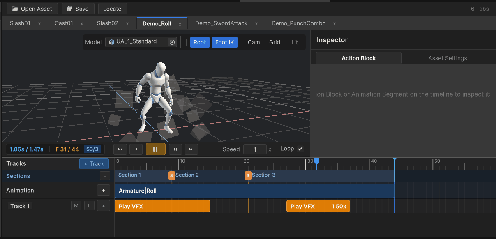
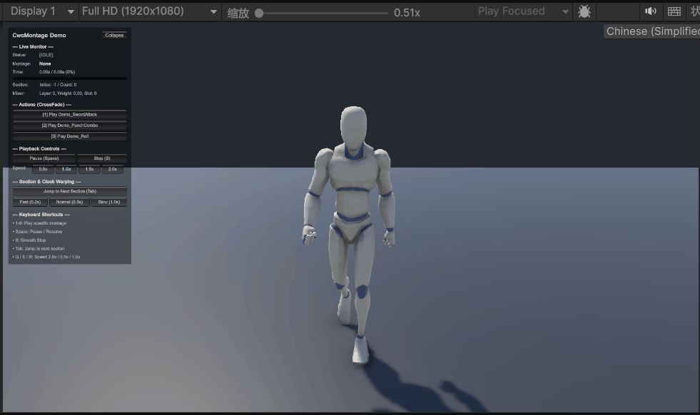

# CwcMontage - High-Performance Playables Animation Montage System

[](https://unity.com/)
[](LICENSE)
[](https://github.com/CwcbbChao/CwcMontage/pulls)
[](https://cwcbbchao.github.io/CwcMontage/)

**English** | [简体中文](README.md)

> **Official Online Documentation**: [https://cwcbbchao.github.io/CwcMontage/](https://cwcbbchao.github.io/CwcMontage/)  
> Visit the online documentation for deep architectural breakdowns, API references, live GIFs, and advanced tutorials.

---

## Overview

`CwcMontage` is a lightweight, high-performance, pure presentation-layer animation montage system tailored for modern action games (ACT / ARPG / Top-Down) in Unity.

Built natively upon Unity's **Playables API**, it adheres strictly to the **Dual-Track Pipeline** philosophy: external gameplay logic (e.g. State Machines, Gameplay Ability Systems) retains authoritative control over timing and gameplay state transitions, while `CwcMontage` orchestrates precise animation sampling, smooth cross-fading, multi-track audio/VFX dispatching, and Root Motion delegation.

---

## Visual Showcase

### 1. Interactive Montage Timeline Editor
Scrub sampling in real-time within the Scene View, zero-allocation preview, and intuitive physical section slicing:



### 2. Runtime Cross-Fading & Section Control
Dual-slot ping-pong cross-fade mixer, adaptive time warping, and guaranteed paired event execution:



---

## Key Features

1. **Pure Presentation Layer & Open-Closed Principle (OCP)**
   - The core runtime does not hardcode any gameplay or audio/VFX behaviors.
   - Extend `MontageActionBlockBase` or `MontageSpatialActionBlockBase` to create custom hitboxes, freeze frames, audio clips, particle spawners, or camera shakes.
2. **Interval Sweep Sampling**
   - Employs incremental half-open intervals `(LastTime, CurrentTime]` to evaluate active spans, eliminating missed events during severe frame-rate drops.
   - Guarantees strict `OnEnter -> OnUpdate -> OnExit` lifecycle pairing with native support for scrubbing and seeking.
3. **Native Geometric Physical Sections**
   - Objectively geometric timestamp slicing without arbitrary semantic coupling (e.g. startup / active / recovery).
   - $O(1)$ zero-allocation section duration queries and range testing.
4. **Adaptive Time Warping**
   - Drive target section durations dynamically via `handle.SyncSectionDuration(sectionIndex, targetDuration)`. The engine automatically scales the Playable playback rate to harmonize animation visual assets with design timing.
5. **Fixed Dual-Slot Ping-Pong Mixer Topology**
   - Features a permanent 2-slot cross-fade mixer graph. Eliminates dynamic node reconnections and array shifting for lifelong PlayableGraph stability and zero runtime GC allocations.
6. **Root Motion Delegation**
   - Dispatches horizontal, vertical, and rotational delta components via `IMontageRootMotionReceiver` or C# events, avoiding intrusive dependencies on existing movement controllers (e.g., CharacterController, KCC).

---

## Installation

### Option A: Install via Unity Package Manager (Git URL)
1. In Unity, open `Window` -> `Package Manager`.
2. Click the `+` icon in the top-left -> select **Add package from git URL...**.
3. Paste:
   ```
   https://github.com/CwcbbChao/CwcMontage.git
   ```
4. Click **Add**.

### Option B: Install via OpenUPM
```bash
openupm add com.cwcbb.cwcmontage
```

---

## Quick Start

### 1. Play a Montage and Synchronize Section Timing
```csharp
using UnityEngine;
using Cwcbb.Tools.CwcMontage;

public class HeroCombatController : MonoBehaviour
{
    [SerializeField] private MontageCoordinator _coordinator;
    [SerializeField] private MontageSequenceSO _swordAttackMontage;

    public void PerformAttack(float windupDuration, float activeDuration, float recoveryDuration)
    {
        // 1. Play montage and obtain a lightweight, generation-checked MontageHandle (16 bytes, zero GC)
        MontageHandle handle = _coordinator.Play(_swordAttackMontage);

        // 2. Synchronize section durations dynamically according to combat attributes
        if (handle.IsValid)
        {
            handle.SyncSectionDuration(0, windupDuration);    // Windup section
            handle.SyncSectionDuration(1, activeDuration);    // Active hitbox section
            handle.SyncSectionDuration(2, recoveryDuration);  // Recovery section
        }
    }
}
```

### 2. Create a Custom Action Block
```csharp
using UnityEngine;
using Cwcbb.Tools.CwcMontage;

[MontageCategory("Combat")]
[MontageColor("#e74c3c")]
[MontageDisplayName("Hit Stop")]
public class HitStopActionBlock : MontageActionBlockBase
{
    [SerializeField] private float _timeScale = 0.05f;

    public override void OnEnter(in MontageActionContext context)
    {
        base.OnEnter(context);
        // Trigger hit freeze frame
    }

    public override void OnExit(in MontageActionContext context)
    {
        base.OnExit(context);
        // Restore time scale
    }
}
```

---

## Interactive Demo Scene

A complete combat demonstration scene is provided:
- **Scene Location**: `Demo/Scenes/MontageDemoScene.unity`
- **Controls**:
  - **1 - 9**: Switch attack combos, rolls, and punches.
  - **Space**: Pause / resume playback.
  - **Tab**: Jump to next physical section immediately.
  - **Q / E / R**: Slow (0.5x) / Normal (1.0x) / Fast (1.5x) time scale.
  - Top-left HUD displays live PlayableGraph ping-pong slot weights and section progress.
- **Clean Stripping**: The entire `Demo` directory can be safely removed before production release with zero residual dependencies on `Runtime` or `Editor`.

---

## License & Third-Party Notices

- The core source code is released under the [MIT License](LICENSE).
- Demo 3D humanoid character models and animations are provided by [Quaternius](https://quaternius.com) under the **CC0 1.0 Universal (Public Domain Dedication)** license.
- Detailed third-party notices can be found in [Third-Party Notices.txt](Third-Party%20Notices.txt).
