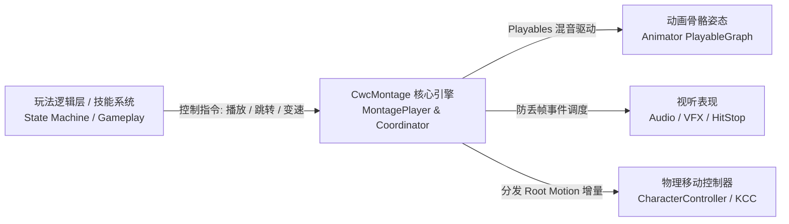

# 项目介绍

## 为什么需要 CwcMontage？

在传统的 Unity 动作游戏（ACT / ARPG）开发中，处理角色动作、视效（VFX）、音效（Audio）与根运动（Root Motion）的协调往往面临以下痛点：

1. **Unity Animator (Mecanim) 的黑盒与延迟**：
   - 过渡混合（Transition）容易产生不可控的跨状态滑步与状态机爆炸。
   - 动画事件（Animation Events）在掉帧严重或时间快速跳转时经常发生**漏触发**或**乱序触发**。
2. **Timeline 的重型与非实时交互性**：
   - Unity Timeline 适合线性过场动画，但在快节奏、频繁被打断（受击打断、闪避取消、蓄力松手）的即时战斗中显得过于笨重。
3. **表现层与逻辑层的严重耦合**：
   - 很多项目直接在动画资产中写死了攻击判定时间、硬编码了音效组件，导致策划修改技能前摇时长时，必须强制美术重新导出动画或重新打点，团队协作极其痛苦。

`CwcMontage` 正是为了解决上述痛点而诞生的**纯表现层**解决方案。

---

## 核心设计理念：表现层与战斗逻辑解耦

在 `CwcMontage` 的体系中，系统遵循明确的单向驱动与职责隔离原则：

- **逻辑层负责业务决策**：外部玩法系统（如有限状态机、行为树或技能系统）负责决定“何时出招”、“连招取消窗口”、“蓄力时长”以及“伤害判定与受击判定”。
- **表现层负责动画与视听**：`CwcMontage` 接收逻辑层的播放、跳转与调速指令，负责多片段混合、图层姿态计算，并将音效、特效等对齐在时间轴上精确触发。
- **生命周期安全清理**：逻辑层随时可调用 `handle.Stop()` 或 `handle.JumpToSection()` 打断或切换动作，`CwcMontage` 确保当前活跃的所有动作块（ActionBlock）立即执行 `OnExit` 安全清理，杜绝特效残留。

---

## 核心组件架构

| 组件名 | 类型 | 职责定位 |
| :--- | :--- | :--- |
| **`MontageSequenceSO`** | `ScriptableObject` | **配置资产**。存储动画片段列表、时间轴分段点（Sections）与多轨道视听动作块。 |
| **`MontageCoordinator`** | `MonoBehaviour` | **角色驱动组件**。挂载在角色上，管理 PlayableGraph 拓扑，驱动多图层混音并分发 Root Motion 增量。 |
| **`MontagePlayer`** | 纯 C# 类 | **播放器内核**。负责增量时间推进、权重计算、半开区间事件扫掠与分段变速。 |
| **`MontageHandle`** | `readonly struct` | **轻量控制句柄**。16 字节值类型，0 GC；封装 Generation ID 代际校验，防止动画结束后出现野指针与串号误操作。 |
| **`MontageActionBlockBase`** | 抽象基类 | **视听动作块基类**。支持开发者继承扩展音效、特效、顿帧、相机震动或自定义判定逻辑。 |
