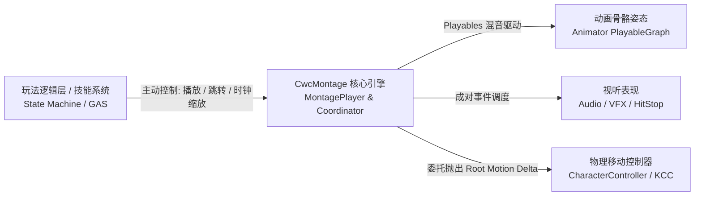

# 项目介绍

## 为什么需要 CwcMontage？

在传统的 Unity 动作游戏（ACT / ARPG）开发中，处理角色动作、视效（VFX）、音效（Audio）与根运动（Root Motion）的协调往往面临以下痛点：

1. **Unity Animator (Mecanim) 的黑盒与延迟**：
   - 过渡混合（Transition）容易产生不可控的跨状态滑步与状态机爆炸。
   - 动画事件（Animation Events）在掉帧严重或时间快速跳转时经常发生**漏触发**或**乱序触发**。
2. **Timeline 的重型与非实时交互性**：
   - Unity Timeline 适合线性过场动画，但在快节奏、频繁被打断（受击打断、闪避取消、蓄力松手）的即时战斗中显得过于笨重。
3. **表现层与逻辑层的严重耦合**：
   - 很多项目直接在动画资产中写死了攻击判定时间、硬编码了音效组件，导致策划修改技能前摇时长时，必须强制美术重新导出动画或重新打点，团队协作极其痛苦。

`CwcMontage` 正是为了解决上述痛点而诞生的**纯表现层**解决方案。

---

## 核心设计理念：逻辑与表现双轨分离 (Dual-Track Pipeline)

在 `CwcMontage` 的体系中，系统严格遵循单向驱动与职责隔离原则：

- **逻辑层全权主导**：外部逻辑层（如有限状态机或技能系统）负责决定“何时出招”、“能否取消”、“蓄力多少进度”、“实际造成的伤害与判定范围”。
- **表现层忠实还原**：`CwcMontage` 只负责接收逻辑层的时钟与跳转指令，将动画骨骼姿态以最高精度混合，并将音效、特效、摄像机震动精确对齐到局部时间轴。
- **互不侵入**：逻辑层随时可以调用 `handle.Stop()` 或 `handle.JumpToSection()` 打断动作，`CwcMontage` 内部的状态机保证当前激活的所有动作块（ActionBlock）立即执行 `OnExit` 安全清理，绝无悬挂特效或音效残留。

---

## 核心组件架构

| 组件名 | 类型 | 职责定位 |
| :--- | :--- | :--- |
| **`MontageSequenceSO`** | `ScriptableObject` | **静态数据资产**。存储单段或多段动画片段、几何时间切分点、多轨道视听动作块配置。 |
| **`MontageCoordinator`** | `MonoBehaviour` | **角色宿主驱动**。挂载在角色 GameObject 上，负责初始化 PlayableGraph 拓扑、捕获并分发 Animator 的 Root Motion。 |
| **`MontagePlayer`** | 纯 C# 类 | **运行时播放器内核**。执行高精度的增量时间推进、区间扫掠事件判定与自适应时钟缩放。 |
| **`MontageHandle`** | `struct` (16 字节) | **安全轻量句柄**。供外部逻辑调用的控制接口，包含代际安全校验（Generation Check），杜绝悬挂引用与闭包 GC。 |
| **`MontageActionBlockBase`** | 抽象基类 | **视听动作块基类**。支持派生自定义的视效、音效、物理冲刺、震屏等逻辑。 |
