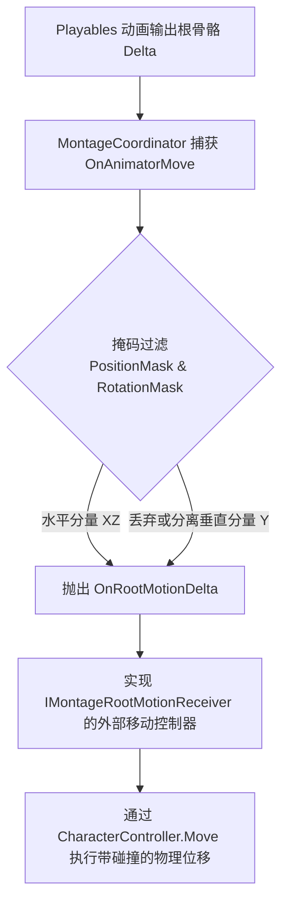

# Root Motion 委托化解耦接入

## 传统 Root Motion 的痛点

在 Unity 默认机制中，开启 `Animator.applyRootMotion` 后，动画的根骨骼位移会直接暴力修改角色的 `Transform.position`。这在以下场景会引发严重灾难：

1. **碰撞穿墙与悬空**：直接修改 Transform 会绕过 `CharacterController` 或 `Rigidbody` 的物理碰撞体 sweep 测试，导致角色冲刺穿墙、悬空踏步或卡进地形。
2. **重力与位移冲突**：动作自带轻微的 Y 轴颠簸，极易覆盖游戏自定义的重力下落速度。
3. **网络同步困难**：服务端无法在纯物理层进行位移校验与回滚。

---

## CwcMontage 的委托解耦方案

`CwcMontage` 采用**“捕获 -> 掩码过滤 -> 委托派发”**的无侵入管道设计：



- 蒙太奇播放器自身**绝不直接修改角色位置**。
- 将位移量（$\Delta \text{Position}$）与旋转量（$\Delta \text{Rotation}$）包装为精确的当帧增量，交由外部移动组件按自己的物理逻辑应用。

---

## 接入实战：对接 CharacterController

### 1. 方式一：实现 `IMontageRootMotionReceiver` 接口（零 GC 推荐）

在你的角色移动控制脚本中实现该接口：

```csharp
using UnityEngine;
using Cwcbb.Tools.CwcMontage;

[RequireComponent(typeof(CharacterController))]
public class PlayerMovementController : MonoBehaviour, IMontageRootMotionReceiver
{
    private CharacterController _characterController;
    private float _verticalVelocity;

    private void Awake()
    {
        _characterController = GetComponent<CharacterController>();
    }

    /// <summary>
    /// 当 Montage 产生 Root Motion 增量时由 MontageCoordinator 自动直接回调
    /// </summary>
    public void OnMontageRootMotion(Vector3 deltaPosition, Quaternion deltaRotation)
    {
        // 1. 应用旋转增量
        transform.rotation = deltaRotation * transform.rotation;

        // 2. 将蒙太奇位移增量与角色重力合并
        Vector3 finalMove = deltaPosition;
        if (!_characterController.isGrounded)
        {
            _verticalVelocity += Physics.gravity.y * Time.deltaTime;
            finalMove.y += _verticalVelocity * Time.deltaTime;
        }
        else
        {
            _verticalVelocity = -1.0f; // 贴地微小下压力
        }

        // 3. 安全执行物理移动（带有完整的碰撞与滑移检测）
        _characterController.Move(finalMove);
    }
}
```

### 2. 方式二：通过 C# 事件监听

如果你不想实现接口，也可以直接在 `MontageCoordinator` 上订阅事件：

```csharp
[SerializeField] private MontageCoordinator _coordinator;

private void OnEnable()
{
    _coordinator.OnRootMotionDelta += HandleRootMotionDelta;
}

private void OnDisable()
{
    _coordinator.OnRootMotionDelta -= HandleRootMotionDelta;
}

private void HandleRootMotionDelta(Vector3 deltaPos, Quaternion deltaRot)
{
    _characterController.Move(deltaPos);
}
```

通过这种解耦设计，美术可以自由使用带有真实位移的高品质 Root Motion 动作，而程序端完全拥有物理运动的绝对掌控权。
